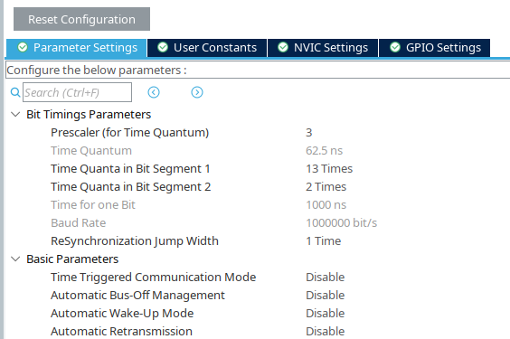

# CAN Configurations

## Configure CAN peripheral using STM32CubeMX
### Bit timing parameters
CAN communication relies on precise bit timing so that all nodes on the bus sample bits at the same moment. Bit timing is defined using **Time Quanta (TQ)**, which are derived from the CAN peripheral clock.

### Key Definitions

#### Time Quanta (TQ)
The smallest time unit in CAN bit timing. All CAN bit segments are expressed as a number of TQs and are derived from the CAN peripheral clock via a prescaler.

#### Nominal Bit Time
The total duration of one CAN bit. It is divided into multiple, non-overlapping time segments.

#### Synchronization Segment (SYNC_SEG)
- Always exactly **1 TQ**
- Marks the expected start of a CAN bit
- Used to synchronize all nodes on the bus

#### Propagation Segment (PROP_SEG)
- Compensates for signal propagation delays on the bus
- Accounts for physical distance, transceiver delay, and wiring delay

#### Phase Segment 1 (PHASE_SEG1)
- Used to compensate for phase errors
- Can be lengthened during resynchronization
- Typically **1–8 TQ**

#### Phase Segment 2 (PHASE_SEG2)
- Used to compensate for phase errors
- Can be shortened during resynchronization
- Minimum length is constrained by the **Synchronization Jump Width (SJW)**

#### Sample Point
The exact point within the nominal bit time at which the bus level is sampled.  
Typically placed between **70%–87.5%** of the bit time for reliable communication.

#### Synchronization Jump Width (SJW)
Defines the maximum number of TQs by which the bit timing can be adjusted during resynchronization.  
It limits how much **PHASE_SEG1** or **PHASE_SEG2** can be lengthened or shortened.

#### Resynchronization
If a node detects a timing mismatch (e.g., due to oscillator drift or long bus length), it uses the SJW to adjust PHASE_SEG1 and PHASE_SEG2. This keeps the sample point aligned across all nodes.

---

### STM32 CAN Bit Timing Register (CAN_BTR)

The STM32 bxCAN peripheral configures bit timing using the **CAN_BTR** register:

- **BRP (10 bits)**  
  Baud Rate Prescaler  
  Divides the CAN peripheral clock to generate the Time Quantum.

- **TS1 (3 bits)**  
  Time Segment 1  
  Represents **PROP_SEG + PHASE_SEG1**

- **TS2 (3 bits)**  
  Time Segment 2  
  Represents **PHASE_SEG2**

- **SJW (2 bits)**  
  Synchronization Jump Width  
  Defines the maximum resynchronization adjustment in TQs.

### Reference
For detailed hardware behavior and constraints, refer to the  
**“Controller Area Network (bxCAN)”** section in the STM32 Reference Manual.

---

### Bit timing parameter calculation
<!-- > **CAN Clock** \
> AHB Clock = System Clock/AHB Prescaler \
> APB Clock (CAN Clock) = AHB Clock/APB Prescaler \
> tq (time quantum) = (CAN_BTR.PRP+1)*(1/APB clock freq) \
> Nominal bit time = tq*(3+CAN_BTR.TS1+CAN_BTR.TS2) \ -->

Time quantum $t_{q}$ can be provided by this simple math.
$$
\begin{align*}
f_{CAN} &= \frac{f_{system}}{PSC_{CAN}} \\
t_{q} &= f_{CAN}^{-1}\\
\end{align*}
$$

Where \
&emsp;&emsp;$f_{CAN}$ is CAN-Clock frequency in $Hz$\
&emsp;&emsp;$f_{system}$ is System-Clock frequency in $Hz$\
&emsp;&emsp;$PSC_{CAN}$ is CAN-Clock frequency prescaler number\
&emsp;&emsp;$t_{q}$ is Time quantum in $s$

With desired CAN bitrate ($bitrate$ in bit per sec), the total time quanta in nominal bit time ($T_{Q,total}$) can be obtained using below calculation.
$$T_{Q,total} = bitrate^{-1}t_{q}^{-1} $$

Additionally, The sampling rate can be gotten by using this
$$rate = \frac{T_{sync}+T_{seg1}} {T_{sync}+T_{seg1}+T_{seg2}}$$
Where \
&emsp;&emsp;$T_{sync}$ is fixed at $1T_{Q}$\
&emsp;&emsp;$T_{seg1}$ is time segment1 which equal to sum of time of propagation-segment and phase-segment1 (between $1T_{Q}$ to $8T_{Q}$)\
&emsp;&emsp;$T_{seg2}$ is time segment2 (between $2T_{Q}$ to $8T_{Q}$)\


> **Example-** Set sampling at 87.5% for 1Mbps bitrate, APB Clock is 48MHz, Prescaler is 3 \
>$f_{CAN} = 48MHz/3 = 16MHz$ \
>$t_{q}(s) = 1/16MHz = 62.5ns$ \
>$T_{Q,total} = 1/(1Mbps \cdot 62.5ns) = 16$\
>Sampling rate $0.875 = (1+T_{seg1})/16$ \
>So, $T_{seg1}$ is $13T_{Q}$, $T_{seg2}$ is $2T_{Q}$.

 \

---

## Transmitting the CAN Data
### Preparing data frame variables

```c
CAN_TxHeaderTypeDef   TxHeader;  // Store header information
uint8_t               TxData[8]; // Store data
uint32_t              TxMailbox; // Store full CAN frame before sending
```

### setting up the header information and data field

```c
TxHeader.StdId = 0x7FF;                 // If using extended frame, leave value to default or set to 0.
//  TxHeader.ExtId = 0x000;               // If using standard frame, leave value to default or set to 0.
TxHeader.IDE = CAN_ID_STD;              // the type of identifier, standard id (CAN_ID_STD) or extended id (CAN_ID_EXT)
TxHeader.RTR = CAN_RTR_DATA;            // the type of frame, data frame (CAN_RTR_DATA) or remote frame (CAN_RTR_REMOTE)
TxHeader.DLC = 2;                       // the length of the frame in Byte
TxHeader.TransmitGlobalTime = DISABLE;  // whether the timestamp counter value captured on start of frame transmission

TxData[0] = 0x00;  // first byte
TxData[1] = 0x11;  // second byte
```
### Sending data frame

By using HAL function generated from CubeMX, the transmission cam be done.
```c
if (HAL_CAN_AddTxMessage(&hcan1, &TxHeader, TxData, &TxMailbox) != HAL_OK) {
    Error_Handler();
}
```

## Receiving the CAN data
### Filter configuration (Example)
To reduce CPU load and avoid handling unwanted messages in software.
```c
CAN_FilterTypeDef  filterConfig;
filterConfig.FilterBank = 0;
filterConfig.FilterMode = CAN_FILTERMODE_IDMASK;
filterConfig.FilterScale = CAN_FILTERSCALE_32BIT;
filterConfig.FilterIdHigh = 0x0000;
filterConfig.FilterIdLow = 0x0000;
filterConfig.FilterMaskIdHigh = 0x0000;
filterConfig.FilterMaskIdLow = 0x0000;
filterConfig.FilterFIFOAssignment = CAN_RX_FIFO0; /* The data will be received in FIFO0 */
filterConfig.FilterActivation = ENABLE;
filterConfig.SlaveStartFilterBank = 14;
if (HAL_CAN_ConfigFilter(&hcan1, &filterConfig) != HAL_OK)
{
  /* Filter configuration Error */
  // Error_Handler();
}
```
  
### Handling CAN Message with Interrupts

Use this function to enable the interrupt, the active interrupt argument can be set using Macro group 'CAN_Interrupts' (found in file stm32f7xx_hal_can.h)
```c

if (HAL_CAN_ActivateNotification(&hcan1, CAN_IT_RX_FIFO0_MSG_PENDING | CAN_IT_RX_FIFO0_FULL) != HAL_OK) {
    // Error_Handler();
}

```

Retrieving the received message header and data.
```c
CAN_RxHeaderTypeDef   RxHeader;
uint8_t               RxData[8];

// Also implement overridden interrupt function respectively to active interrupt argument
void HAL_CAN_RxFifo0MsgPendingCallback(CAN_HandleTypeDef *hcan)
{
  if (HAL_CAN_GetRxMessage(hcan, CAN_RX_FIFO0, &RxHeader, RxData) != HAL_OK)
  {
    Error_Handler();
  }
  if ((RxHeader.StdId == 0x1FF))
  {
	  // parse frame and trigger some flag after that
  }
}
```